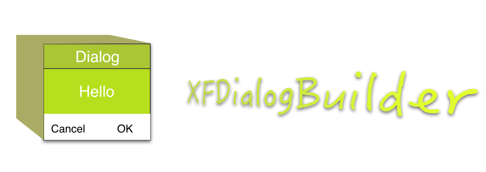
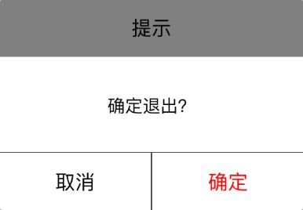
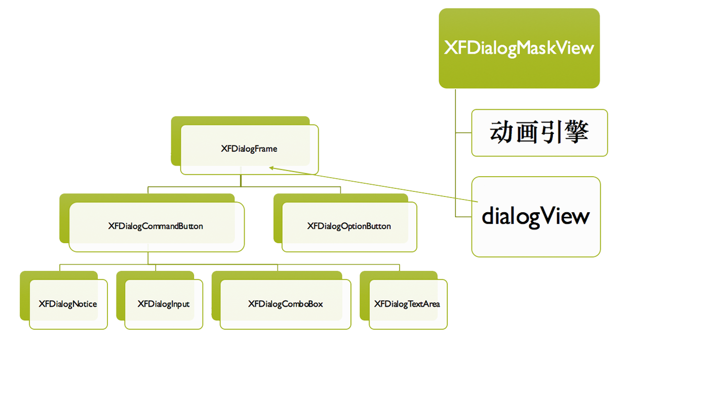

[](http://cocoadocs.org/docsets/XFDialogBuilder)


A configable dialog for IOS. Developer can custom mask layer,window size,UI theme,text content,font,layout content,push and pop Animation. 
可配置型IOS对话框，使用者定制蒙版层背景、窗口大小、UI主题、文本内容、字体大小、布局内容、弹出消失动画引擎。


##前言
当初项目中要使用对话框处理各种信息，在github和code4app中找了几个中意的，但都不能完全和项目进行融合，这些开源项目动画效果炫、UI很精致，但定制性不强，它们封的太死板了。本想自己随便布个局，就能显示一个对话框，但项目很多地方都要显示这样的对话框，复用性太差，基于此，决定自己搭一个对话框框架模板，然后根据基本模板向下扩展，在项目不停变化，这个框架也经历了多次迭代，做了对正确、错误信息、输入验证的处理，动画引擎的加入，向外提供不同样式的配置字段，这才开源出来。

##XFDialogBuilder框架特点
1.快速开发，使用OC式JSON搭建界面。

2.相比其它高度封装+酷炫库([SIAlertView](https://github.com/Sumi-Interactive/SIAlertView)、[SCLAlertView](https://github.com/dogo/SCLAlertView)、[AMSmoothAlertView](https://github.com/mtonio91/AMSmoothAlert)等)，本框架UI定制性更强,，需求更符合国情，是真正能拿到自己项目用的。

3.使用者能分别自定义弹入、弹出动画引擎，可使用IOS自带动画方式，也可用其它第三方引擎，如[pop](https://github.com/facebook/pop)、[MMTweenAnimation](https://github.com/adad184/MMTweenAnimation)、[JHChainableAnimations](https://github.com/jhurray/JHChainableAnimations)等（兼容所有UIView动画引擎的嵌入)。

4.扩展性强，提供多种对话框类型，没有提供的类型开发者可自己基于相关模板基类进行扩展。

5.内置强大输入框验证系统，开发者可自定义配置验证规则。

##安装
1、通过cocoapods
> pod 'XFDialogBuilder','1.2.9'

2、手动加入

把XFDialogBuilder整个目录拖入到工程，添加依赖库`pop`（考虑到帮开发者通过`pop`来自定义加入动画引擎，所以有个帮助类依赖于它）。

##Demo运行注意
需要用命令行:

1.`cd ...XFDialogBuilderExample`("..."要根据自己的路径来)

2.`pod install`

##开发文档
###一、快速开始
1.导入主头文件`#import "XFDialogBuilder.h"`

2.在控制器引用`@property (nonatomic, weak) XFDialogFrame *dialogView;`

3.显示对话框


<p align="center">
    
</p>

```objc
    __weak ViewController *weakSelf = self;
    self.dialogView =
    [[[XFDialogNotice dialogWithTitle:@"提示"
                               attrs:@{
                                          XFDialogTitleViewBackgroundColor : [UIColor grayColor],
                                          XFDialogNoticeText: @"确定退出？",
                                          XFDialogLineColor : [UIColor darkGrayColor],
                                          }
                         commitCallBack:^(NSString *inputText) {
                             [weakSelf.dialogView hideWithAnimationBlock:nil];
                         }] showWithAnimationBlock:nil] setCancelCallBack:^{
                             NSLog(@"取消对话框！");
                         }];
```

###二、框架文档
####1.顶级显示容器`XFDialogFrame`
这是布局的核心类，也作为与`XFMaskView`沟通的桥梁，后者是用来显示和动画执行关键类，所以基于`XFDialogFrame`的子控件具有显示和动画执行的能力，所以开发者不用关心`XFMaskView`。

下图是框架整体结构：



#####1.1.容器配置属性
子控件类都会继承自`XFDialogFrame`这些配置：
```objc
// 注意：以下属性都有默认设置
/** 遮罩层背景色 UIColor类型*/
extern const NSString *XFDialogMaskViewBackgroundColor;
/** 遮罩层透明度 float类型*/
extern const NSString *XFDialogMaskViewAlpha;
/** 对话框仿UIAlterView毛玻璃效果 BOOL类型*/
extern const NSString *XFDialogEnableBlurEffect;
/** 对话框大小 CGSize类型*/
extern const NSString *XFDialogSize; // 如果不设置，会根据当前对话框类型自己计算
/** 对话框圆角 float类型*/
extern const NSString *XFDialogCornerRadius;
/** 对话框背景色 UIColor类型*/
extern const NSString *XFDialogBackground;
/** 对话框线条颜色 UIColor类型*/
extern const NSString *XFDialogLineColor;
/** 对话框线条宽度 float类型*/
extern const NSString *XFDialogLineWidth;
/** 对话框标题背景色 UIColor类型*/
extern const NSString *XFDialogTitleViewBackgroundColor;
/** 对话框标题颜色 UIColor类型*/
extern const NSString *XFDialogTitleColor;
/** 对话框标题字体大小 float类型*/
extern const NSString *XFDialogTitleFontSize;
/** 对话框标题高度 float类型*/
extern const NSString *XFDialogTitleViewHeight;
/** 对话框标题对齐方式 枚举NSTextAlignment类型*/
extern const NSString *XFDialogTitleAlignment;
/** 对话框标题是否为多行 BOOL类型*/
extern const NSString *XFDialogTitleIsMultiLine;
/** 对话框多行标题的Margin float类型*/
extern const NSString *XFDialogMultiLineTitleMargin;
```
#####1.2.构建对话框
所有子控件调用下面方法显示对话框，子控件添加自己的视图则通过`- (void)addContentView;`勾子方法。
```objc
/**
 *  构建对话框
 *
 *  @param title          标题
 *  @param attrs          对话框属性
 *  @param commitCallBack 确定输入内容的回调
 *
 */
+ (instancetype)dialogWithTitle:(NSString *)title attrs:(NSDictionary *)attrs commitCallBack:(commitClickBlock)commitCallBack;
```
#####1.3.动画引擎
设置动画引擎,内建有默认`Core Animation`动画，不自定义动画时可以传`nil`。
```objc
/**
 *  通过动画引擎显示,使用默认可传nil
 *
 *  @param animationEngineBlock 动画执行Block，如果为空则为默认效果
 */
- (instancetype)showWithAnimationBlock:(addAnimationEngineBlock)animationEngineBlock;
/**
 *  通过动画引擎隐藏,使用默认可传nil
 *  @param animationEngineBlock 动画执行Block，如果为空则为默认效果
 */
- (void)hideWithAnimationBlock:(addAnimationEngineBlock)animationEngineBlock;
/**
 *  设置取消事件的动画效果（只有在自定义动画时要设置）
 */
@property (nonatomic, copy) addAnimationEngineBlock cancelAnimationEngineBlock;
```

使用内置pop引擎工具类`XFDialogAnimationUtil`
```objc
/**
 *  推入对话框动画
 *
 *  @return 动画Block
 */
+ (addAnimationEngineBlock)topToCenter;
/**
 *  退出对话框动画
 *
 *  @return 动画Block
 */
+ (addAnimationEngineBlock)centerToTop;
```

使用`addAnimationEngineBlock`自定义动画

Block定义:
```objc
/**
 *  动画执行代码
 *
 *  @param view 执行动画的视图
 *
 *  @return 动画执行时间
 */
typedef float(^addAnimationEngineBlock)(UIView *view);
```
以pop动画引擎为例的使用方法(建议将自定义代码封装成工具类，可以参考`XFDialogAnimationUtil`类实现):
```objc
// 显示动画，传入的View是显示的dialogView
[self.dialogView showWithAnimationBlock:^float(UIView *view) {
        view.y = -view.height;
        
        POPSpringAnimation *springPosY=[POPSpringAnimation animationWithPropertyNamed:kPOPLayerPositionY];
        springPosY.fromValue = @(0);
        springPosY.toValue= @(view.maskView.centerY);
        springPosY.springBounciness=10;
        [view.layer pop_addAnimation:springPosY forKey:@"springPosY"];
        // 显示动画直接返回0即可
        return 0;
    }];
// 消失动画，传入的View是显示的dialogView
 [self.dialogView hideWithAnimationBlock:^float(UIView *view) {
        POPSpringAnimation *springPosY=[POPSpringAnimation animationWithPropertyNamed:kPOPLayerPositionY];
        springPosY.toValue= @(-view.maskView.height);
        
        springPosY.springBounciness=10;
        POPSpringAnimation *springScaleXY=[POPSpringAnimation animationWithPropertyNamed:kPOPLayerScaleXY];
        springScaleXY.toValue=[NSValue valueWithCGPoint:CGPointMake(0.1, 0.1)];
        
        springScaleXY.springBounciness=20;
        [view.layer pop_addAnimation:springPosY forKey:@"springPosY"];
        [view.layer pop_addAnimation:springScaleXY forKey:@"springScaleXY"];
        // 消失动画必须返回动画执行时间
        return 0.5;
    }];
```

#####1.4.扩展子对话框
显示自己想要的对话框，如果完全自己自定义就继承`XFDialogFrame`,如果想拥有底部“取消”、“确定”按钮而只定义上面内容就继承`XFDialogCommandButton`，然后通过以下两个方法进行扩展（可以参考`XFDialogTextArea`类的扩展实现）:

```objc
// 第一步： 添加子视图内容
- (void)addContentView
{
    // 调用父类实现
    [super addContentView];
    
    
}

// 第二步：返回对话框大小：父类有默认的大小，如果这个自定义对话框添加子视图，就必须自己计算整个对话框显示的大小
- (CGSize)dialogSize{
    // 获得标题高度（宽度是对话框宽度）
    CGFloat titleH = [self realTitleHeight];
    // 获得命令式按钮高度（宽度是对话框宽度）
    CGFloat confirmButtonH = [self realCommandButtonHeight];
    // 计算自己添加的视图大小
    
    return  CGSizeMake(XFDialogDefW, titleH + confirmButtonH /* + ...其它高度 */);
}

// 第三步：布局子视图
- (void)layoutSubviews
{
    [super layoutSubviews];
    
    // 计算添加的子视图Frame
}
```


####2.命令式按钮控件`XFDialogCommandButton`
所有具有“确定”、“取消”的对话框都继承自`XFDialogCommandButton`，这个类具有“确定”、“取消”的回调，并有在“确定”时执行的抽象验证方法，验证方法的具体实现在它的子控件`XFDialogInput`。

扩展配置属性：
```objc
/** 按钮高度 float类型*/
extern const NSString *XFDialogCommandButtonHeight;
/** 取消按钮标题颜色 UIColor类型*/
extern const NSString *XFDialogCancelButtonTitleColor;
/** 确定按钮标题颜色 UIColor类型*/
extern const NSString *XFDialogCommitButtonTitleColor;
/** 取消按钮标题文字 NSString类型*/
extern const NSString *XFDialogCancelButtonTitle;
/** 确定按钮标题文字 NSString类型*/
extern const NSString *XFDialogCommitButtonTitle;
/** 按钮标题文字字体大小 float类型*/
extern const NSString *XFDialogCommitButtonFontSize;
/** 禁用中线 BOOL类型*/
extern const NSString *XFDialogCommitButtonMiddleLineDisable;
```

#####2.1.命令式回调
成功回调,可以直接使用上面的显示对话框类方法赋值，定义如下：
```objc
/**
 *  点击事件的回调
 *
 *  @param inputText 确定内容
 */
typedef void(^commitClickBlock)(id inputData);
@property (nonatomic, copy, readonly) commitClickBlock commitCallBack;

/**
 *  设置对话框取消时执行的代码
 *
 *  @param cancelCallBack 取消Block
 */
- (instancetype)setCancelCallBack:(CancelClickBlock)cancelCallBack;
```
确定消息的回传：
```objc
/**
 *  子控件可以覆盖确定时的输入内容，用于作为参数输出给commitCallBack回调，默认返回"commit"
 */
@property (nonatomic, copy) id inputData;
```


#####2.2.抽象验证

验证器核心方法:
```objc
/**
 *  子控件是否有验证方法，没有或验证成功返回nil
 *
 *  @return 返回错误字符串
 */
- (NSString *)validate;
/**
 *  子控件可以覆盖确定按钮事件发生错误的方法
 *
 *  @param errorMessage 错误消息
 */
- (void)onErrorWithMesssage:(NSString *)errorMessage;
```

####3.功能强大的输入对话框`XFDialogInput`
之所以说它强大，是因为它能做的事很多：
- 可添加无数个UITextField,只有屏幕能显示得下
- 支持文本框的普通文本显示和密码框显示，并支持密码明文切换显示
- 支持对每个文本框进行单独的样式配置
- 支持跟随键盘向上浮动，并能处理键盘“下一步”动作跳转到下一个文本框
- 强大的验证系统，支持单个文本框的单项验证、多个文本框的多项验证（如重置密码），验证失败后以红框显示错误文本框
- 类方法扩展一个错误回调

扩展属性：
```objc
/** 文本框数组 NSArray类型*/
extern const NSString *XFDialogInputFields;
/** 文本框类弄 枚举UIKeyboardType类型*/
extern const NSString *XFDialogInputTypeKey;
/** 文本框是否是密码 BOOL类型*/
extern const NSString *XFDialogInputIsPasswordKey;
/** 文本框Placeholder NSString类型*/
extern const NSString *XFDialogInputPlaceholderKey;
/** 文本框光标颜色 UIColor类型*/
extern const NSString *XFDialogInputHintColor;
/** 文本框文字颜色 UIColor类型*/
extern const NSString *XFDialogInputTextColor;
/** 文本框Margin float类型*/
extern const NSString *XFDialogInputMargin;
/** 文本框高度 float类型*/
extern const NSString *XFDialogInputHeight;
/** 文本框字体大小 float类型*/
extern const NSString *XFDialogInputFontSize;
/** 文本框单项验证数组 NSArray类型*/
extern const NSString *XFDialogValidatorMatchers;
/** 文本框多项验证数组 NSArray类型*/
extern const NSString *XFDialogMultiValidatorMatchers;
/** 文本框密码明文设置 NSDictionary类型*/
extern const NSString *XFDialogInputPasswordEye;
/** 文本框密码图标大小 float类型*/
extern const NSString *XFDialogInputEyeSize;
/** 文本框显示密文图标名 NSString类型*/
extern const NSString *XFDialogInputEyeOpenImage;
/** 文本框明文图标名 NSString类型*/
extern const NSString *XFDialogInputEyeCloseImage;
```
#####3.1.扩展创建对话框类方法，支持错误回调：
```objc
/**
 *  显示对话框
 *
 *  @param title          标题
 *  @param attrs          对话框属性
 *  @param commitCallBack 确定输入内容的回调
 *  @param errorCallBack  错误回调
 */
+ (instancetype)dialogWithTitle:(NSString *)title attrs:(NSDictionary *)attrs commitCallBack:(commitClickBlock)commitCallBack errorCallBack:(errorHappenBlock)errorCallBack;
```
#####3.2.单项文本框验证使用：
```objc
    self.dialogView =
    [[XFDialogInput dialogWithTitle:@"登录"
                                 attrs:@{
                                         XFDialogTitleViewBackgroundColor : [UIColor orangeColor],
                                         XFDialogTitleColor: [UIColor whiteColor],
                                         XFDialogLineColor: [UIColor orangeColor],
                                         XFDialogInputFields:@[
                                                 @{
                                                     XFDialogInputPlaceholderKey : @"输入用户名",
                                                     XFDialogInputTypeKey : @(UIKeyboardTypeDefault),
                                                     },
                                                 @{
                                                     XFDialogInputPlaceholderKey : @"输入新密码",
                                                     XFDialogInputTypeKey : @(UIKeyboardTypeDefault),
                                                     XFDialogInputIsPasswordKey : @(YES),
                                                     XFDialogInputPasswordEye : @{
                                                             XFDialogInputEyeOpenImage : @"ic_eye",
                                                             XFDialogInputEyeCloseImage : @"ic_eye_close"
                                                             }
                                                     },
                                                 ],
                                         XFDialogInputHintColor : [UIColor purpleColor],
                                         XFDialogInputTextColor: [UIColor orangeColor],
                                         XFDialogCommitButtonTitleColor: [UIColor orangeColor],
                                         XFDialogMultiValidatorMatchers: @[
                                                 @{
                                                     ValidatorConditionKey: ^(NSArray<UITextField *> *textfields){
        
        return textfields[0].text.length < 6;
    },ValidatorErrorKey: @"用户名小于6位！"
                                                     },
                                          @{
                                              ValidatorConditionKey: ^(NSArray<UITextField *> *textfields){
        
        return textfields[1].text.length < 6;
    },ValidatorErrorKey: @"密码小于6位！"
                                              }]
                                         }
                        commitCallBack:^(NSString *inputText) {
                            [weakSelf.dialogView hideWithAnimationBlock:nil];
                        } errorCallBack:^(NSString *errorMessage) {
                            NSLog(@"error -- %@",errorMessage);
                        }] showWithAnimationBlock:nil];
```
#####3.3.多项文本框验证：
```objc
self.dialogView =
    [[XFDialogInput dialogWithTitle:@"修改密码"
                                 attrs:@{
                                         XFDialogTitleViewBackgroundColor : [UIColor greenColor],
                                         XFDialogTitleColor: [UIColor whiteColor],
                                         XFDialogLineColor: [UIColor greenColor],
                                         XFDialogInputFields:@[
                                                 @{
                                                     XFDialogInputPlaceholderKey : @"请输入新密码",
                                                     XFDialogInputTypeKey : @(UIKeyboardTypeDefault),
                                                     XFDialogInputIsPasswordKey : @(YES),
                                                     XFDialogInputPasswordEye : @{
                                                             XFDialogInputEyeOpenImage : @"ic_eye",
                                                             XFDialogInputEyeCloseImage : @"ic_eye_close"
                                                             }
                                                     },
                                                 @{
                                                     XFDialogInputPlaceholderKey : @"再次输入密码",
                                                     XFDialogInputTypeKey : @(UIKeyboardTypeDefault),
                                                     XFDialogInputIsPasswordKey : @(YES),
                                                     XFDialogInputPasswordEye : @{
                                                             XFDialogInputEyeOpenImage : @"ic_eye",
                                                             XFDialogInputEyeCloseImage : @"ic_eye_close"
                                                             }
                                                     },
                                                 ],
                                         XFDialogInputHintColor : [UIColor purpleColor],
                                         XFDialogInputTextColor: [UIColor greenColor],
                                         XFDialogCommitButtonTitleColor: [UIColor greenColor],
                                         XFDialogMultiValidatorMatchers: @[
                                                 @{
                                                     ValidatorConditionKey: ^(NSArray<UITextField *> *textfields){
        
        return textfields[0].text.length < 6 || textfields[1].text.length < 6;
    },ValidatorErrorKey: @"密码小于6位"
                                                     },
                                                 @{
                                                     ValidatorConditionKey: ^(NSArray<UITextField *> *textfields){
        
        return ![textfields[0].text isEqualToString:textfields[1].text];
    },ValidatorErrorKey: @"两次密码不一致！"
                                                     }]
                                         }
                        commitCallBack:^(NSArray<NSString *> *inputs) {
                            NSLog(@"输入第一个的密码：%@",inputs[0]);
                            NSLog(@"输入第二个的密码：%@",inputs[1]);
                            [weakSelf.dialogView hideWithAnimationBlock:nil];
                        } errorCallBack:^(NSString *errorMessage) {
                            NSLog(@"error -- %@",errorMessage);
                        }] showWithAnimationBlock:nil];

```


